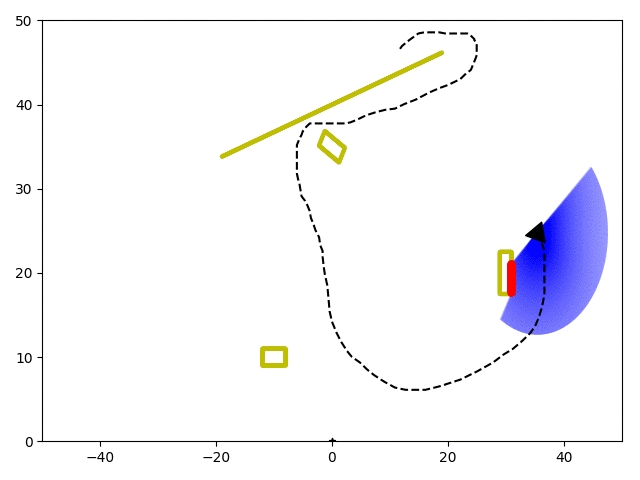

# LIDAR Simulator for Dynamic Environments

This is a simple LIDAR simulator developed in python. 

Requires:
 - python3
 - numpy library
 - matplotlib library (for images and videos)
 - yaml (for reading the environment we create inside the config folder)
 - moviepy library (for videos) 

Define static and/or dynamic obstacles (e.g. walls, vehicles, etc.) in a yaml file inside the config folder:
 - Check toy1.yaml file to see how to define an environment. Area and obstacles should be defined in the yaml file.

Output:
 - carmen.log.gfs or time_x_y_occopancy.csv, robot_pose.npz, all_data_i.npz, frame_i.png, movie.gif/mp4

v1 released
v2 released - new addition: moving robot 

Instructions: See [video](https://youtu.be/bhd1EDYTIiw)
- Step 1: Specify the enviroment as a yaml file (see the config folder)
- Step 2: Specify the lidar parameters such as distance, angle, etc, and file configurations at the bottom of run_simulation.py
- Step 3: run run_simulation.py
- Step 4: Draw the robot's trajectory by clicking on various locations on the gui (close to exit) or hard code the pose/s [video](https://youtu.be/bhd1EDYTIiw)
- Output: robot's poses as a .npz file, .csv or carmen data file, all data for each time step as .npz, and images for each time step

Note: Output .csv file: column1=time, column2=longitude, column3=latitude, column4=occupied/free. This file is compatible with [Bayesian Hilbert Maps](https://github.com/RansML/Bayesian_Hilbert_Maps).
