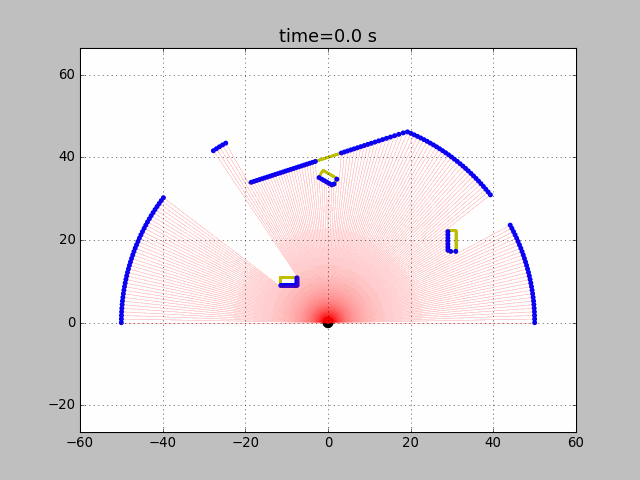

# simulator_lidar

This is a simple LIDAR simulator developed in python3. A world with moving vehicles can be set up by instantiating "Obstacle" class. 

Requires:
 - python3
 - numpy library
 - matplotlib library (for images and videos)
 - moviepy library (for videos) 

Define:
 - obstacles (position, velocity and acceleration)

Output:
 - carmen.log.gfs, time_x_y.csv, frame_i.png, movie.gif/mp4

v1 released
v2 updated - new addition: moving robot 

Instructions:
Step 1: Specify the output folder and file name
Step 2: Specify the environemnt (use an existing or create your own)
Step 3: Specify the lidar parameters such as distance, angle, etc,
Step 4: Draw the robot's path by clicking on various locations on the gui (close to exit) or hard code the pose/s
Output: .csv or carmen file and images
Note: Output file type .csv: column1=time, column2=longitude, column3=latitude, column4=occupied/free

<object width="425" height="350">
  <param name="movie" value="https://youtu.be/bhd1EDYTIiw" />
  <param name="wmode" value="transparent" />
  <embed src="https://youtu.be/bhd1EDYTIiw"
         type="application/x-shockwave-flash"
         wmode="transparent" width="425" height="350" />
</object>
